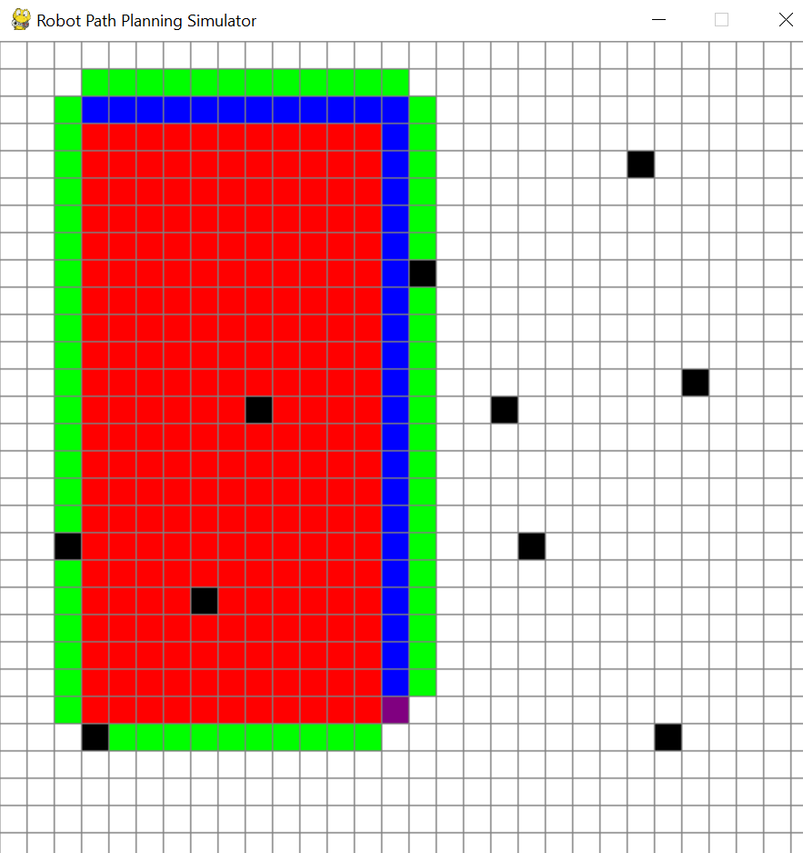

# robot-path-planning-a-star
Interactive robot path planning simulator using the A* algorithm with Python and Pygame.
## Demo

# Robot Path Planning Simulator using A* Algorithm

This project demonstrates robot path planning using the **A* (A-Star) algorithm** in a grid-based environment.

The simulator allows a robot to find the **shortest path between a start node and a goal node while avoiding obstacles**.

## Features

* Interactive grid environment
* Select start and goal nodes
* Add obstacles
* Real-time visualization of A* search
* Shortest path generation

## Controls

Left Click
• First click → Start node
• Second click → Goal node
• Next clicks → Obstacles

Right Click
• Remove nodes or obstacles

SPACE
• Run the A* pathfinding algorithm

C
• Clear the grid

## Technologies Used

* Python
* Pygame
* A* Pathfinding Algorithm

## Applications

This type of path planning is widely used in:

* Autonomous robots
* Warehouse robots
* Game AI navigation
* Self-driving vehicles

